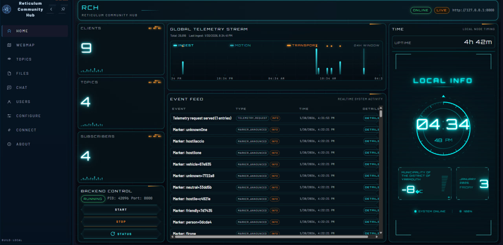
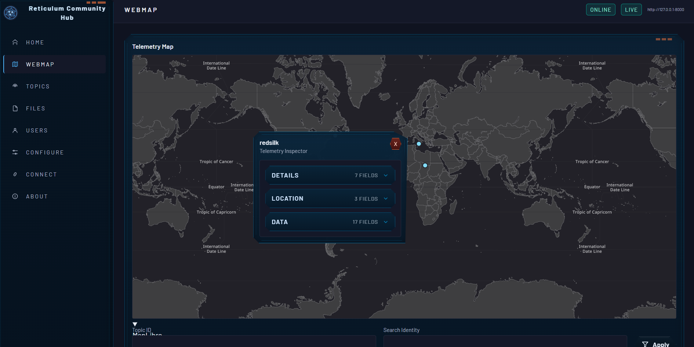
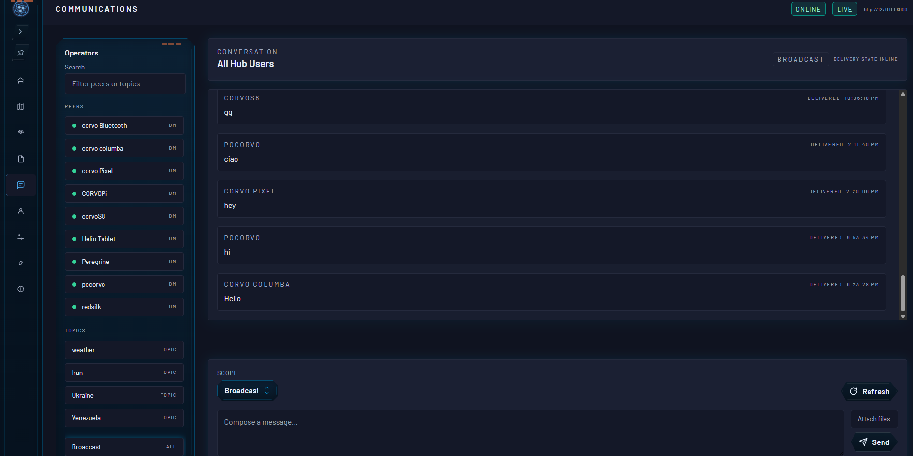

# Reticulum Community Hub (RCH)


Reticulum Community Hub (RCH) is a shared coordination point for mesh networks. It allows people and groups to exchange messages, share situational updates, and distribute files in a structured and reliable way, even across intermittent or low-connectivity environments, while remaining independent from centralized internet services.
<div style="clear: both;"></div>

## Why?

> "RCH begins from a simple refusal:  When this illusion breaks, highly optimized global systems fail first."

Read our full manifesto: [docs/Manifesto_Reticulum_Community_Hub.md](docs/Manifesto_Reticulum_Community_Hub.md)

## What it does

- One-to-many and topic-scoped message fan-out over LXMF.
- Telemetry collection and on-demand telemetry responses.
- File and image attachment storage with retrieval and deletion by ID.
- sci-fi themed admin UI.
- Operator-managed map markers backed by Reticulum object identities and telemetry updates.
- TAK bridge for chat and location updates (Optional).
- Capability announces embedded in Reticulum announces for feature discovery.

## What it looks like






## Quickstart (from source)

1. Clone and enter the repo.
   ```bash
   git clone https://github.com/FreeTAKTeam/Reticulum-Community-Hub.git
   cd Reticulum-Community-Hub
   ```
2. Create and activate a virtual environment.
   ```bash
   python -m venv .venv
   # Linux/macOS
   source .venv/bin/activate
   # Windows (PowerShell)
   .venv\Scripts\Activate.ps1
   ```
3. Install dependencies.
   ```bash
   python -m pip install --upgrade pip
   python -m pip install -e .
   ```
4. Prepare a storage directory and config.
   - Copy `RCH_Store/config.ini` into your storage directory.
   - Adjust paths in the `[hub]`, `[files]`, and `[images]` sections.
5. Start the hub.
   ```bash
   python -m reticulum_telemetry_hub.reticulum_server \
       --storage_dir ./RCH_Store \
       --display_name "RCH"
   ```
   Or start the hub + northbound API locally with the new entrypoint:
   ```bash
   rch start --data-dir ./RCH_Store --port 8000 --log-level info
   ```

For configuration, services, and client usage details, see `docs/userManual.md`.

## Install from PyPI

1. Create and activate a virtual environment.
   ```bash
   python -m venv .venv
   # Linux/macOS
   source .venv/bin/activate
   # Windows (PowerShell)
   .venv\Scripts\Activate.ps1
   ```
2. Install the package.
   ```bash
   python -m pip install --upgrade pip
   python -m pip install ReticulumCommunityHub
   ```
3. Start the hub (point at your storage directory).
   ```bash
   python -m reticulum_telemetry_hub.reticulum_server --storage_dir /path/to/RCH_Store
   ```

## Northbound API and admin UI

The northbound FastAPI service exposes REST + WebSocket endpoints used by the admin UI.

- Run the hub + API together (recommended for chat/message sending):
  ```bash
  rch start --data-dir ./RCH_Store --port 8000 --log-level info
  ```
  The gateway binds to `127.0.0.1` for local-only access.
- Check or stop the backend:
  ```bash
  rch status --data-dir ./RCH_Store
  rch stop --data-dir ./RCH_Store
  ```
- Run only the API server (read-only unless you provide a message dispatcher):
  ```bash
  uvicorn reticulum_telemetry_hub.northbound.app:app --host 127.0.0.1 --port 8000
  ```
- Protect admin endpoints by setting `RCH_API_KEY` (accepts `X-API-Key` or Bearer token).
- Marker identity encryption is derived from the hub identity (no extra key configuration required).
- The admin UI sidebar can be collapsed and pinned (stored per-browser).
- Telemetry map markers render MDI icons when telemetry payloads include `telemetry_type`, `symbol`, `category`, or `type`.
- The WebMap shows a live latitude/longitude readout for the map cursor.
- Marker symbols load from `rch-symbols.yaml` (override with `RTH_SYMBOL_REGISTRY_PATH`).
- `/api/v1/app/info` includes the hub Reticulum destination (`reticulum_destination`) for display on the About page.
- File/image attachments support delete operations that remove both metadata and on-disk content (`DELETE /File/{id}`, `DELETE /Image/{id}`).
- The UI lives in `ui/`:

  ```bash
  cd ui
  npm install
  npm run dev
  ```

  The UI uses Vite 6 (installed via `npm install`).

  Set `VITE_RCH_BASE_URL` when the UI should target a different hub.

## Electron desktop packaging (Windows + Raspberry Pi OS)

The `electron/` folder contains a minimal desktop wrapper that bundles the UI and
loads the hub API from `127.0.0.1`.

1. Install Electron dependencies:
   ```bash
   cd electron
   npm install
   ```
2. Run the Electron shell in dev mode (starts the Vite dev server):
   ```bash
   npm run dev
   ```
3. Build installers:
   ```bash
   npm run dist
   ```
4. Build Windows installer + portable EXE:
   ```bash
   npm run dist -- --win
   ```

Electron packaging expects a bundled backend executable. Install PyInstaller and
build it before packaging:

```bash
python -m pip install -e .
python -m pip install pyinstaller
cd electron
npm run build:backend
```

Before each Electron build, the desktop app version is synchronized from
`pyproject.toml` automatically.

Windows artifact naming:

- Installer: `RCH_win Install_<version>.exe`
- Portable: `RCH_win Portable_<version>.exe`

For Raspberry Pi OS, build on Linux and target the desired architecture:

```bash
npm run dist -- --linux --armv7l
npm run dist -- --linux --arm64
```

Packaged builds default to `http://127.0.0.1:8000` for the API when loaded from
`file://`. Override in the Connect page or set `VITE_RTH_BASE_URL` /
`VITE_RTH_WS_BASE_URL` at build time.

Packaged desktop builds also launch the bundled backend automatically. Set
`RCH_BACKEND_MANAGED=false` to disable autostart, or override with
`RCH_DATA_DIR`, `RCH_BACKEND_PORT`, and `RCH_LOG_LEVEL`.

Marker management endpoints (used by the WebMap UI):

- `GET /api/markers` (list stored markers)
- `GET /api/markers/symbols` (list available marker symbols)
- `POST /api/markers` (create marker with type/symbol/lat/lon, optional name/category/notes/ttl_seconds)
- `PATCH /api/markers/{object_destination_hash}/position` (update marker coordinates)

## Documentation

- `docs/README.md` (documentation map)
- `docs/userManual.md` (user and operator guide)
- `architecture.md` (system overview and references)
- `API/ReticulumCommunityHub-OAS.yaml` (REST/OpenAPI reference)

## Contributing

We welcome and encourage contributions. Please include appropriate tests and follow the
project coding standards.

### Linting

RCH uses Ruff for linting with a 120-character line length and ignores `E203` to align
with Black-style slicing.

- With Poetry (installs dev dependencies, including Ruff):

  ```bash
  poetry install --with dev
  poetry run ruff check .
  ```

- With a plain virtual environment:

  ```bash
  python -m pip install ruff
  ruff check .
  ```

## License

This project is licensed under the Eclipse Public License (EPL). For more details, refer to the
`LICENSE` file in the repository.

## Support

For issues or support, open a GitHub issue

## Support Reticulum

You can help support the continued development of open, free and private communications systems
by donating via one of the following channels to Mark, the original Reticulum author:

- Monero: 84FpY1QbxHcgdseePYNmhTHcrgMX4nFfBYtz2GKYToqHVVhJp8Eaw1Z1EedRnKD19b3B8NiLCGVxzKV17UMmmeEsCrPyA5w
- Ethereum: 0xFDabC71AC4c0C78C95aDDDe3B4FA19d6273c5E73
- Bitcoin: 35G9uWVzrpJJibzUwpNUQGQNFzLirhrYAH
- Ko-Fi: https://ko-fi.com/markqvist
