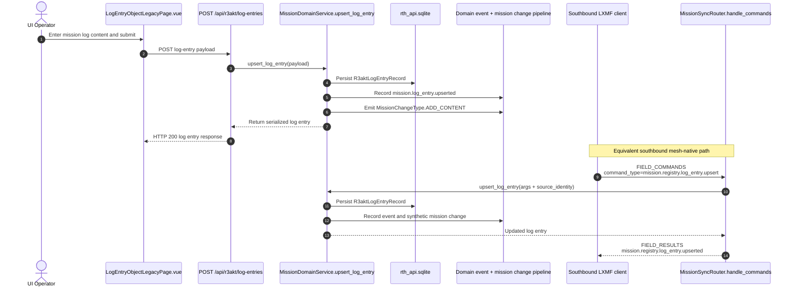

# RCH Architecture

## Overview

Reticulum Community Hub (RCH) is split into a Reticulum/LXMF runtime, a storage
layer, telemetry ingestion and sampling, a northbound API, and an admin UI. It
also includes optional services (gpsd, tak_cot) and an internal adapter for
transport-agnostic integrations.

## Core components

- `reticulum_telemetry_hub/reticulum_server/`: Hub runtime, command manager,
  message dispatch, event log, outbound queue, and Reticulum wiring.
- `reticulum_telemetry_hub/api/`: API service and storage facade for topics,
  subscribers, identities, attachments, map markers, and zones.
- `reticulum_telemetry_hub/lxmf_telemetry/`: Telemetry ingestion, persistence,
  and sampling/broadcast logic.
- `reticulum_telemetry_hub/northbound/`: FastAPI REST + WebSocket interface.
- `reticulum_telemetry_hub/config/`: Unified config loader and runtime models.
- `reticulum_telemetry_hub/atak_cot/`: TAK/CoT bridge helpers.
- `reticulum_telemetry_hub/internal_api/`: Internal API schemas and adapters.

## Data flows

- **LXMF commands / southbound transport**: inbound LXMF commands enter through
  `FIELD_COMMANDS` (or the escaped-body fallback for clients without command
  fields), are normalized by the command manager, validated, applied via the
  API service, and replied to over LXMF using `FIELD_RESULTS` or a specialized
  response field such as `FIELD_TELEMETRY_STREAM`,
  `FIELD_FILE_ATTACHMENTS`, or `FIELD_IMAGE`. Topic identifiers are normalized
  to one canonical string form across publish, route, persist, and subscribe
  paths. When an inbound message includes the `RTHDelivery` sideband envelope,
  the runtime validates required headers, accepted content types, UTC/TTL/skew
  constraints, and rejects invalid messages before command execution.
  `FIELD_THREAD` and `FIELD_GROUP` are echoed into replies when present.
- **Mission/checklist sync envelopes**: inbound `FIELD_COMMANDS` payloads with
  `command_type` are routed through `mission_sync` and `checklist_sync` with
  persisted capability ACL checks. Mission commands still return standardized
  accepted/rejected/result envelopes in `FIELD_RESULTS`; checklist command
  successes are silent by default, while invalid or unauthorized checklist
  commands may return one compact `rejected` diagnostic.
- **Telemetry**: telemetry fields are decoded and stored in `telemetry.db`.
  Telemetry requests return a `FIELD_TELEMETRY_STREAM` payload, optionally
  filtered by topic.
- **Northbound API**: REST endpoints map to the same command and storage paths,
  while WebSocket streams read from the event log and telemetry broadcaster.
  Canonical join/leave routes are exposed at `/RCH` with `/RTH` retained as a
  compatibility alias. Checklist lifecycle routes are exposed under
  `/checklists/*` and R3AKT registry routes under `/api/r3akt/*`. Northbound
  message dispatch attaches `RTHDelivery` to hub-originated outbound chat,
  enforces exactly one routing mode (`broadcast`, `fanout`, or `targeted`),
  and persists outbound delivery metadata including `Message-ID`, attempts,
  ack state, drop reasons, and propagation fallback transitions.
- **Operational zones**: zone create/list/update/delete requests are validated
  by `ZoneService` and persisted to the `zones` store for WebMap polygon
  overlays and mission-area awareness.

## Mission Log Flow

Mission log creation from the UI uses the northbound HTTP route
`POST /api/r3akt/log-entries`. The southbound LXMF path accepts the equivalent
`mission.registry.log_entry.upsert` command in `FIELD_COMMANDS`; both paths
converge on the same mission-domain service and persistence/event pipeline.

```mermaid
flowchart LR
  subgraph UI["Admin UI"]
    page["`LogEntryObjectLegacyPage.vue`\nmission log editor"]
    client["`post(endpoints.r3aktLogEntries, payload)`"]
    page --> client
  end

  subgraph Northbound["Northbound HTTP"]
    route["`POST /api/r3akt/log-entries`\n`routes_r3akt.upsert_log_entry()`"]
  end

  subgraph Domain["Shared Mission Domain"]
    service["`MissionDomainService.upsert_log_entry(payload)`"]
    store["Persist `R3aktLogEntryRecord`\nin `rth_api.sqlite`"]
    event["Record domain event\n`mission.log_entry.upserted`"]
    change["Emit synthetic mission change\n`MissionChangeType.ADD_CONTENT`"]
    service --> store
    service --> event
    service --> change
  end

  subgraph Southbound["Southbound LXMF Equivalent"]
    command["Inbound `FIELD_COMMANDS`\n`command_type: mission.registry.log_entry.upsert`\n`args: { mission_uid, callsign, content, ... }`"]
    router["`MissionSyncRouter.handle_commands()`"]
    reply["Reply via `FIELD_RESULTS`\n`mission.registry.log_entry.upserted`"]
    command --> router --> service
    service --> reply
  end

  client --> route --> service
```



## DR-2 Structured SITREP Generation and Parsing

RCH supports structured SITREP objects with:

- `priority`
- `coordinates_ref` (reference to telemetry objects, not raw coordinates)
- `notes`
- `timestamp`
- `origin_identity`

### SITREP datapack standard

For compact wire representation, SITREP packets use canonical datapack keys:

- `v`: schema version
- `p`: priority
- `r`: coordinates reference (`telemeter_id` + `sensor_id` + sample time)
- `n`: notes
- `t`: timestamp
- `o`: origin identity

### Secure Reticulum transport

- SITREP datapacks are wrapped in a Reticulum envelope for transport.
- When destination identity material is available, payload is encrypted before
  transmit.
- Imported encrypted payloads are decrypted, then parsed back into structured
  SITREP objects.

### Parsing and persistence/logging

- Parsed SITREPs are reconstructed as first-class domain objects.
- Each successful import writes a `MissionChange` record
  (`change_type = SITREP_IMPORTED`) linked to the SITREP identity.
- `Mission` and `Task` remain first-class planning concepts; SITREPs can be
  associated to mission/task context and reflected in mission change history.
- A `LogEntry` is also written for auditability and traceability of parsing,
  validation, and persistence outcomes.

## DR-8 Asset and Resource Registry

R3AKT supports structured registry management for:

- Assets
- Mission task assignments
- Client/team-member profiles
- Skills
- Team member and skill mappings

### Domain model coverage

- `Asset` tracks resource identity, type, lifecycle status, location, and notes.
- `MissionTaskAssignment` links `Mission`, `checklistTask`, and `TeamMember`
  (with optional asset usage and assignment metadata).
- `ClientProfile` provides structured profile metadata for each `TeamMember`.
- `Skill` defines a reusable skill catalog.
- `TeamMemberSkill` models the many-to-many mapping between team members and
  skills, including validation metadata.
- `TaskSkillRequirement` captures minimum skill requirements per task.

## Operational Zone Model

RCH supports operator-managed polygon zones used by the WebMap UI.

### Domain model coverage

- `Zone` stores zone identity, name, polygon points, and lifecycle timestamps.
- `ZonePoint` stores each polygon vertex as latitude/longitude.
- Zone validation enforces bounded coordinates, a minimum of 3 points, a
  maximum of 200 points, and non-self-intersecting polygons.
- Northbound REST exposes CRUD endpoints under `/api/zones` for UI and
  automation clients.

## R3AKT Domain Persistence

RCH persists R3AKT mission/checklist domain aggregates in `r3akt_*` tables
within `rth_api.sqlite`, including:

- Mission/team/member/asset/skill/assignment registries.
- Checklist templates, columns, tasks, cells, and feed publications.
- Immutable domain events and snapshots with time-based retention.

## Reference documents

- `docs/southbound.md` (normative LXMF southbound field contract)
- `docs/internal-api.md` (normative internal API contract)
- `docs/internal-api-overview.md` (internal API overview)
- `docs/internal-api-examples.md` (example envelopes)
- `API/ReticulumCommunityHub-OAS.yaml` (REST/OpenAPI spec)
- `docs/TelemetryDocumentation.md` (Sideband telemetry wire format)
- `docs/tak.md` (TAK integration)
- `ui-architecture.md` (UI architecture)
- `docs/ui-design.md` (UI design spec)
- `docs/ui-wireframe.md` (UI wireframes)
- `ui/README.md` (UI dev/build steps)
- `docs/dataArchitecture.md` (domain class diagram including SITREP and zone models)
- `docs/architecture/R3AKT_Domain_Class_Diagram.mmd` (standalone Mermaid source)
