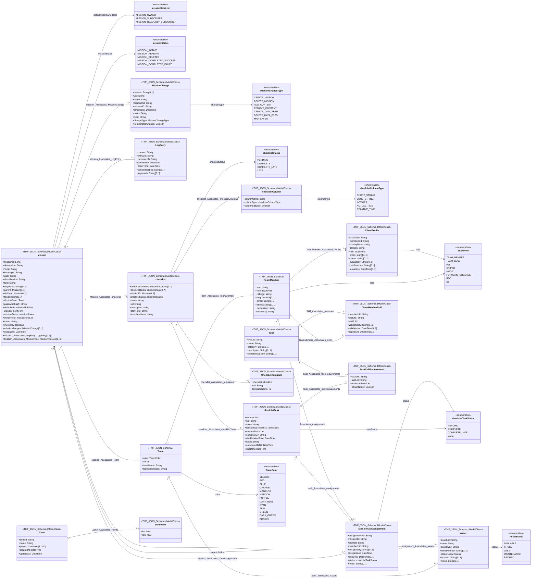

# RCH Data Architecture

```mermaid
classDiagram
  direction LR

  class missionRoleList {
    <<enumeration>>
    MISSION_OWNER
    MISSION_SUBSCRIBER
    MISSION_READONLY_SUBSCRIBER
  }

  class missionStatus {
    <<enumeration>>
    MISSION_ACTIVE
    MISSION_PENDING
    MISSION_DELETED
    MISSION_COMPLETED_SUCCESS
    MISSION_COMPLETED_FAILED
  }

  class MissionChangeType {
    <<enumeration>>
    CREATE_MISSION
    DELETE_MISSION
    ADD_CONTENT
    REMOVE_CONTENT
    CREATE_DATA_FEED
    DELETE_DATA_FEED
    MAP_LAYER
  }

  class TeamRole {
    <<enumeration>>
    TEAM_MEMBER
    TEAM_LEAD
    HQ
    SNIPER
    MEDIC
    FORWARD_OBSERVER
    RTO
    K9
  }

  class checklistStatus {
    <<enumeration>>
    PENDING
    COMPLETE
    COMPLETE_LATE
    LATE
  }

  class checklistTaskStatus {
    <<enumeration>>
    PENDING
    COMPLETE
    COMPLETE_LATE
    LATE
  }

  class checklistColumnType {
    <<enumeration>>
    SHORT_STRING
    LONG_STRING
    INTEGER
    ACTUAL_TIME
    RELATIVE_TIME
  }

  class AssetStatus {
    <<enumeration>>
    AVAILABLE
    IN_USE
    LOST
    MAINTENANCE
    RETIRED
  }

  class Mission {
    <<TMF_JSON_Schema,dModelClass>>
    <<BaseSchema>>
    +Missionid: Long
    +description: String
    +Topic: String
    +baselayer: String
    +path: String
    +classification: String
    +tool: String
    +keywords: String[0..*]
    +parent: Mission[0..1]
    +children: Mission[0..*]
    +feeds: String[0..*]
    -MissionTeam: Team
    +passwordhash: String
    +defaultrole: missionRoleList
    -MissionPriority: int
    -missionStatus: missionStatus
    +ownerRole: missionRoleList
    +token: String
    +inviteonly: Boolean
    +missionchanges: MissionChange[0..*]
    +expiration: DateTime
    +Mission_Associates_LogEntry: LogEntry[0..*]
    +Mission_Associates_MissionRole: missionRoleList[0..1]
  }

  class Team {
    <<TMF_JSON_Schema>>
    <<WCMVFIvalue>>
    +color: TeamColor
    -uid: int
    +teamName: String
    +teamdescription: String
  }

  class TeamMember {
    <<TMF_JSON_Schema>>
    +icon: string
    +role: TeamRole
    +callsign: string
    +freq: decimal[0..1]
    +email: string[0..1]
    +phone: string[0..1]
    +modulation: string
    -rnsIdentity: string
  }

  class LogEntry {
    <<TMF_JSON_Schema,dModelClass>>
    <<BaseSchema>>
    +content: String
    +entryuid: String
    +missionUID: String
    +servertime: DateTime
    +clientTime: DateTime
    +contenthashes: String[0..*]
    +keywords: String[0..*]
  }

  class checklist {
    <<TMF_JSON_Schema,dModelClass>>
    <<XSElement>>
    +checklistColumns: checklistColumn[1..*]
    +checklistTasks: checklistTask[0..*]
    -missionID: Mission[0..1]
    -checklistStatus: checklistStatus
    +name: string
    +uid: string
    +description: string
    +startTime: string
    +templateName: string
  }

  class checklistTask {
    <<TMF_JSON_Schema,dModelClass>>
    +number: int
    +uid: string
    +value: string
    +taskStatus: checklistTaskStatus
    +customStatus: int
    +completeBy: String
    +dueRelativeTime: DateTime
    +notes: string
    +completedDTG: DateTime
    +dueDTG: DateTime
  }

  class checklistColumn {
    <<TMF_JSON_Schema,dModelClass>>
    +columnName: string
    +columnType: checklistColumnType
    +columnEditable: Boolean
  }

  class CheckListtemplate {
    <<TMF_JSON_Schema,dModelClass>>
    +checklist: checklist
    -uid: String
    -templateName: int
  }

  class MissionTaskAssignment {
    <<TMF_JSON_Schema,dModelClass>>
    +assignmentUid: String
    +missionID: String
    +taskUid: String
    +memberUid: String
    +assignedBy: String[0..1]
    +assignedAt: DateTime
    +dueDTG: DateTime[0..1]
    +status: checklistTaskStatus
    +notes: String[0..1]
  }

  class MissionChange {
    <<TMF_JSON_Schema,dModelClass>>
    +hashes: String[0..*]
    +uid: String
    +name: String
    +creatorUid: String
    +missionID: String
    +timestamp: DateTime
    +notes: String
    +type: String
    +changeType: MissionChangeType
    +isFederatedChange: Boolean
  }

  class Asset {
    <<TMF_JSON_Schema,dModelClass>>
    +assetUid: String
    +name: String
    +assetType: String
    +serialNumber: String[0..1]
    +status: AssetStatus
    +location: String[0..1]
    +notes: String[0..1]
  }

  class Zone {
    <<TMF_JSON_Schema,dModelClass>>
    +zoneId: String
    +name: String
    +points: ZonePoint[3..200]
    +createdAt: DateTime
    +updatedAt: DateTime
  }

  class ZonePoint {
    <<TMF_JSON_Schema,dModelClass>>
    +lat: float
    +lon: float
  }

  class ClientProfile {
    <<TMF_JSON_Schema,dModelClass>>
    +profileUid: String
    +memberUid: String
    +displayName: string
    +callsign: string
    +role: TeamRole
    +email: string[0..1]
    +phone: string[0..1]
    +availability: String[0..1]
    +certifications: String[0..*]
    +lastActive: DateTime[0..1]
  }

  class Skill {
    <<TMF_JSON_Schema,dModelClass>>
    +skillUid: String
    +name: String
    +category: String[0..1]
    +description: String[0..1]
    +proficiencyScale: String[0..1]
  }

  class TeamMemberSkill {
    <<TMF_JSON_Schema,dModelClass>>
    +memberUid: String
    +skillUid: String
    +level: int
    +validatedBy: String[0..1]
    +validatedAt: DateTime[0..1]
    +expiresAt: DateTime[0..1]
  }

  class TaskSkillRequirement {
    <<TMF_JSON_Schema,dModelClass>>
    +taskUid: String
    +skillUid: String
    +minimumLevel: int
    +isMandatory: Boolean
  }

  class TeamColor {
    <<enumeration>>
    YELLOW
    RED
    BLUE
    ORANGE
    MAGENTA
    MAROON
    PURPLE
    DARK_BLUE
    CYAN
    TEAL
    GREEN
    DARK_GREEN
    BROWN
  }

  Mission "0..1" --> "0..*" Mission : parent/children
  Mission "1" o-- "0..*" MissionChange : Mission_Associates_MissionChange
  Mission "1" o-- "0..*" LogEntry : Mission_Associates_LogEntry
  Mission "1" o-- "1..*" Team : Mission_Associates_Team
  Mission "1" o-- "0..*" MissionTaskAssignment : Mission_Associates_TaskAssignments
  Team "1" o-- "1..*" TeamMember : Team_Associates_TeamMember
  Team "1" o-- "0..*" Asset : Team_Associates_Assets
  Zone "1" o-- "3..200" ZonePoint : Zone_Associates_Points

  Mission "1" --> "0..*" checklist : Mission_Associates_checklist
  checklist "1" o-- "0..*" checklistTask : checklist_Associates_checklistTasks
  checklist "1" o-- "1..*" checklistColumn : checklist_Associates_checklistColumns
  checklist "1" --> "0..1" CheckListtemplate : checklist_Associates_templates
  checklistTask "1" o-- "0..*" MissionTaskAssignment : task_Associates_assignments
  checklistTask "1" o-- "0..*" TaskSkillRequirement : task_Associates_skillRequirements
  TeamMember "1" o-- "0..*" MissionTaskAssignment : member_Associates_assignments
  MissionTaskAssignment "0..*" -- "0..*" Asset : assignment_Associates_assets
  TeamMember "1" --> "0..1" ClientProfile : TeamMember_Associates_Profile
  TeamMember "1" o-- "0..*" TeamMemberSkill : TeamMember_Associates_Skills
  Skill "1" o-- "0..*" TeamMemberSkill : Skill_Associates_members
  Skill "1" o-- "0..*" TaskSkillRequirement : Skill_Associates_taskRequirements

  Mission --> missionRoleList : defaultRole/ownerRole
  Mission --> missionStatus : missionStatus
  MissionChange --> MissionChangeType : changeType
  Asset --> AssetStatus : status
  Team --> TeamColor : color
  TeamMember --> TeamRole : role
  ClientProfile --> TeamRole : role
  checklist --> checklistStatus : checklistStatus
  checklistTask --> checklistTaskStatus : taskStatus
  MissionTaskAssignment --> checklistTaskStatus : status
  checklistColumn --> checklistColumnType : columnType
```
