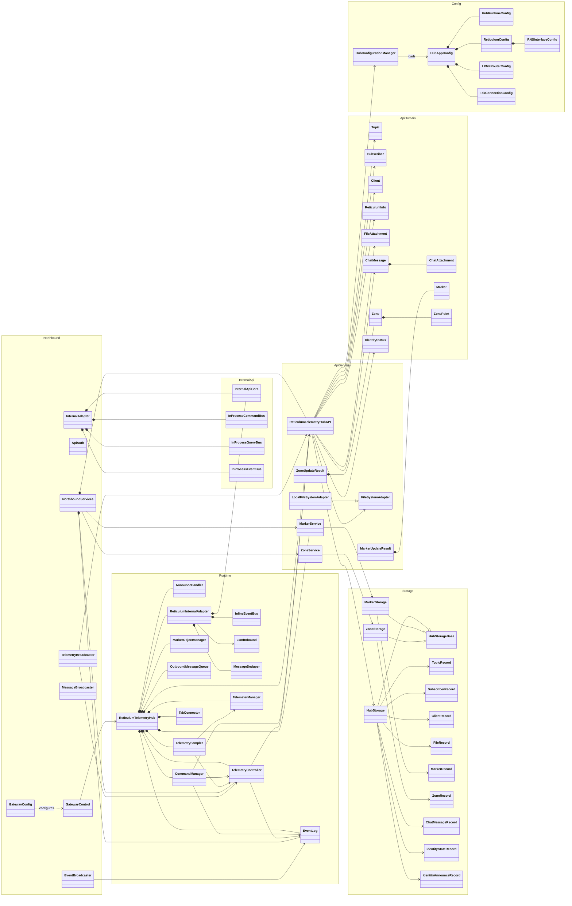
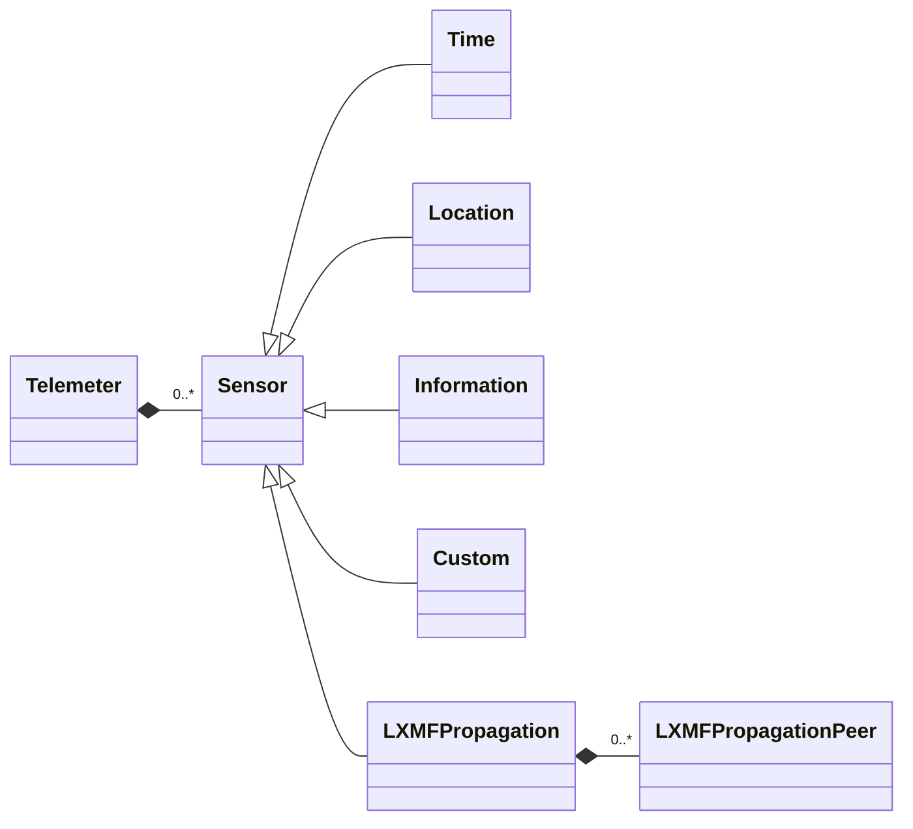

# RCH Data Architecture (Current Code Model)

`docs/architecture/R3AKT_Domain_Class_Diagram.mmd` tracks the target/future
R3AKT domain model. This document tracks the classes currently implemented in
`reticulum_telemetry_hub/`.

## API Domain Classes (Detailed)

```mermaid
classDiagram
  direction LR

  class Topic {
    +topic_name: str
    +topic_path: str
    +topic_description: str
    +topic_id: Optional[str]
  }

  class Subscriber {
    +destination: str
    +topic_id: Optional[str]
    +reject_tests: Optional[int]
    +metadata: Dict[str, Any]
    +subscriber_id: Optional[str]
  }

  class Client {
    +identity: str
    +last_seen: datetime
    +display_name: Optional[str]
    +metadata: Dict[str, Any]
  }

  class ReticulumInfo {
    +is_transport_enabled: bool
    +is_connected_to_shared_instance: bool
    +reticulum_config_path: str
    +database_path: str
    +storage_path: str
    +file_storage_path: str
    +image_storage_path: str
    +app_name: str
    +rns_version: str
    +lxmf_version: str
    +app_version: str
    +app_description: str
    +reticulum_destination: Optional[str]
  }

  class FileAttachment {
    +name: str
    +path: str
    +category: str
    +size: int
    +media_type: Optional[str]
    +topic_id: Optional[str]
    +created_at: datetime
    +updated_at: datetime
    +file_id: Optional[int]
  }

  class Marker {
    +local_id: str
    +object_destination_hash: Optional[str]
    +origin_rch: Optional[str]
    +object_identity_storage_key: Optional[str]
    +marker_type: str
    +symbol: str
    +name: str
    +category: str
    +lat: float
    +lon: float
    +notes: Optional[str]
    +time: Optional[datetime]
    +stale_at: Optional[datetime]
    +created_at: datetime
    +updated_at: datetime
  }

  class ZonePoint {
    +lat: float
    +lon: float
  }

  class Zone {
    +zone_id: str
    +name: str
    +points: List[ZonePoint]
    +created_at: datetime
    +updated_at: datetime
  }

  class ChatAttachment {
    +file_id: int
    +category: str
    +name: str
    +size: int
    +media_type: Optional[str]
  }

  class ChatMessage {
    +direction: str
    +scope: str
    +state: str
    +content: str
    +source: Optional[str]
    +destination: Optional[str]
    +topic_id: Optional[str]
    +attachments: List[ChatAttachment]
    +created_at: datetime
    +updated_at: datetime
    +message_id: Optional[str]
  }

  class IdentityStatus {
    +identity: str
    +status: str
    +last_seen: Optional[datetime]
    +display_name: Optional[str]
    +metadata: Dict[str, Any]
    +is_banned: bool
    +is_blackholed: bool
  }

  Zone *-- "0..*" ZonePoint
  ChatMessage *-- "0..*" ChatAttachment
```

## Core Runtime Classes

## Telemetry Persistence Classes

## Scope

- These diagrams represent active runtime/data classes and their direct
  relationships.
- R3AKT mission/checklist backend persistence now includes additive `r3akt_*`
  tables in `rth_api.sqlite` for `Mission`, `MissionChange`, `Team`,
  `TeamMember`, `Asset`, `Skill`, `TeamMemberSkill`, `TaskSkillRequirement`,
  `Checklist`, `ChecklistTemplate`, `ChecklistTask`, `ChecklistColumn`,
  `ChecklistCell`, `ChecklistFeedPublication`, and `MissionTaskAssignment`.
- Relationship normalization tables include `r3akt_mission_zone_links`,
  `r3akt_team_member_client_links`, `r3akt_assignment_assets`, and
  `r3akt_mission_rde` for explicit association integrity.
- Domain auditability is provided by immutable `r3akt_domain_events` and
  `r3akt_domain_snapshots` tables with retention.
- Schema-only transport models are not expanded here (for example
  `northbound/models.py` and `internal_api/v1/schemas.py`).
- Additional telemetry sensor subclasses live under
  `reticulum_telemetry_hub/lxmf_telemetry/model/persistance/sensors/`.
