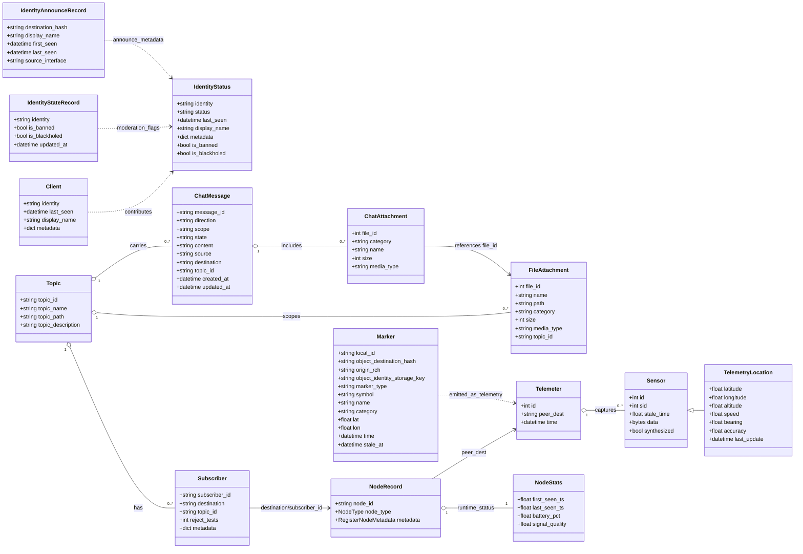

# RCH Data Architecture

```mermaid
classDiagram
    direction LR

    class Topic {
        +string topic_id
        +string topic_name
        +string topic_path
        +string topic_description
    }

    class Subscriber {
        +string subscriber_id
        +string destination
        +string topic_id
        +int reject_tests
        +dict metadata
    }

    class NodeRecord {
        +string node_id
        +NodeType node_type
        +RegisterNodeMetadata metadata
    }

    class NodeStats {
        +float first_seen_ts
        +float last_seen_ts
        +float battery_pct
        +float signal_quality
    }

    class Client {
        +string identity
        +datetime last_seen
        +string display_name
        +dict metadata
    }

    class IdentityStatus {
        +string identity
        +string status
        +datetime last_seen
        +string display_name
        +dict metadata
        +bool is_banned
        +bool is_blackholed
    }

    class IdentityStateRecord {
        +string identity
        +bool is_banned
        +bool is_blackholed
        +datetime updated_at
    }

    class IdentityAnnounceRecord {
        +string destination_hash
        +string display_name
        +datetime first_seen
        +datetime last_seen
        +string source_interface
    }

    class FileAttachment {
        +int file_id
        +string name
        +string path
        +string category
        +int size
        +string media_type
        +string topic_id
    }

    class ChatAttachment {
        +int file_id
        +string category
        +string name
        +int size
        +string media_type
    }

    class ChatMessage {
        +string message_id
        +string direction
        +string scope
        +string state
        +string content
        +string source
        +string destination
        +string topic_id
        +datetime created_at
        +datetime updated_at
    }

    class Marker {
        +string local_id
        +string object_destination_hash
        +string origin_rch
        +string object_identity_storage_key
        +string marker_type
        +string symbol
        +string name
        +string category
        +float lat
        +float lon
        +datetime time
        +datetime stale_at
    }

    class Telemeter {
        +int id
        +string peer_dest
        +datetime time
    }

    class Sensor {
        +int id
        +int sid
        +float stale_time
        +bytes data
        +bool synthesized
    }

    class TelemetryLocation {
        +float latitude
        +float longitude
        +float altitude
        +float speed
        +float bearing
        +float accuracy
        +datetime last_update
    }

    Topic "1" o-- "0..*" Subscriber : has
    Topic "1" o-- "0..*" FileAttachment : scopes
    Topic "1" o-- "0..*" ChatMessage : carries
    ChatMessage "1" o-- "0..*" ChatAttachment : includes
    ChatAttachment --> FileAttachment : references file_id

    Subscriber --> NodeRecord : destination/subscriber_id
    NodeRecord "1" o-- "1" NodeStats : runtime_status

    Client ..> IdentityStatus : contributes
    IdentityStateRecord ..> IdentityStatus : moderation_flags
    IdentityAnnounceRecord ..> IdentityStatus : announce_metadata

    NodeRecord --> Telemeter : peer_dest
    Telemeter "1" o-- "0..*" Sensor : captures
    Sensor <|-- TelemetryLocation
    Marker ..> Telemeter : emitted_as_telemetry
```
