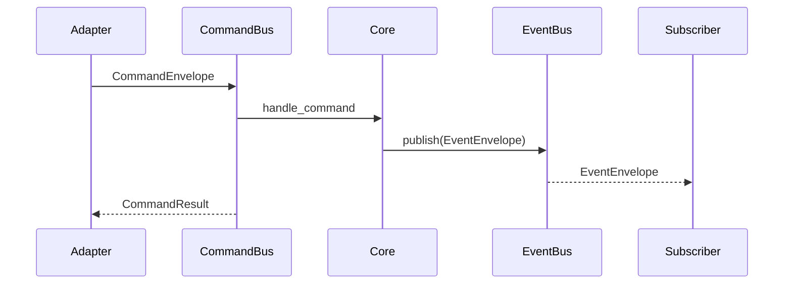
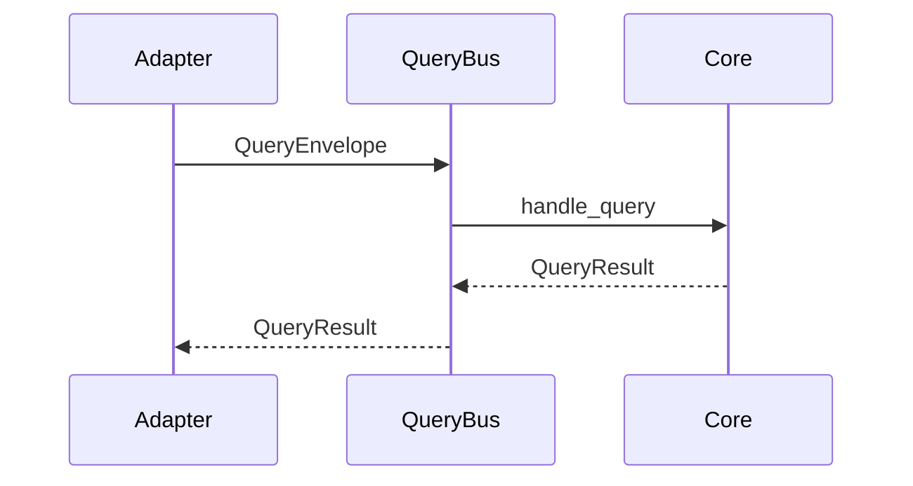

# Internal API Overview (Non-Normative)

This document is a practical guide to the internal API. The authoritative
contract remains `internal-api.md`.

## Architecture Summary

- Internal API uses command, query, and event channels.
- Hub core owns state and emits events.
- Adapters translate external inputs into internal envelopes.

## Sequence Diagrams

### Command + Event Flow



### Query Flow



## Dev Defaults and Transport Configuration

- In-process transports are the default implementation.
- Defaults:
  - `InProcessCommandBus(max_queue_size=64)`
  - `InProcessQueryBus(max_queue_size=64)`
  - `InProcessEventBus(max_queue_size=64)`
- Buses must be started before dispatching.
- Adapters should build envelopes using `select_api_version()` so the
  supported version is negotiated in one place.

Example wiring (simplified):

```python
event_bus = InProcessEventBus()
core = InternalApiCore(event_bus)
command_bus = InProcessCommandBus()
query_bus = InProcessQueryBus()
command_bus.register_handler(core.handle_command)
query_bus.register_handler(core.handle_query)
await event_bus.start()
await command_bus.start()
await query_bus.start()
```

## Logging and Correlation

- `command_id` and `event_id` are logged by the core.
- `correlation_id` matches the originating command or query id.
- Use structured logging fields to reconstruct causal flow.
